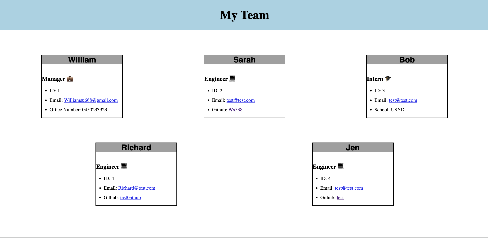

# GenerateMyTeam

## Descriptiopn 

GenerateMyTeam is a backend application created with node.js to create your very own team by following the prompts given. This project was inspired by learning node.js, OOP and writing tests. This project has taught me OOP while writing tests and to create dynamic HTML pages through javascript. The link below shows a demonstration of how to run the application, and how to run the tests. 

## Features 

Clicking an email address allows you to send an email to the following address with your default email client.

Clicking on the Github username will open the page to the person's Github profile.

## Walkthrough

[Walkthrough Video](https://drive.google.com/file/d/1HUvMHxdAa9_hKJyHZYPIDfOvuVG_zJdK/view)

## Installation

To install this project, after you fork, download the package inquirer8.2.4 by opening the integrated terminal and entering "npm i inquirer8.2.4" and download npm jest by running "npm i jest". 
To run the application, in the integrated terminal, run "node index.js" and following the prompts.

## Tests
There are 4 written tests for each of the js files in the lib. To run the tests, open the integrated terminal and enter "npm test". 